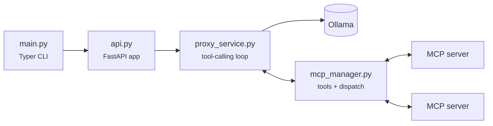

# Architecture

## Modules

### `main.py` — the CLI

Validates inputs, checks the port and Ollama health *before* starting uvicorn, then
stashes runtime configuration on `app.state`.

That last part isn't incidental. uvicorn is started by import string
(`"ollama_mcp_bridge.api:app"`), so nothing can be passed in as constructor arguments —
`app.state` is the only channel from the CLI to the application.

### `lifecycle.py` — startup and shutdown

The FastAPI lifespan reads `app.state`, builds the `MCPManager` and `ProxyService`, and
holds them in module-level globals exposed through `get_mcp_manager()` and
`get_proxy_service()`. Routes go through those getters and return **503** when they're
`None`.

### `api.py` — the routes

Four real routes: `/health`, `POST /api/chat`, `/version`, and a catch-all
`/{path_name:path}` proxy.

!!! warning "The catch-all is registered last"

    It matches every path and every method. Any new route must be declared **above** it
    or it will never be reached.

### `proxy_service.py` — the tool-calling loop

Two parallel implementations that must be kept in sync:

- `_proxy_with_tools_non_streaming`
- `_proxy_with_tools_streaming`

Both follow the same shape: POST to Ollama with `tools` injected, extract
`message.tool_calls`, execute them through the `MCPManager`, append `{"role": "tool", ...}`
messages, repeat. On reaching `max_tool_rounds`, a final call goes out with `tools = None`
so the model must answer.

The streaming variant parses Ollama's NDJSON with `iter_ndjson_chunks` and forwards every
chunk to the client verbatim while sniffing it for tool calls.

### `mcp_manager.py` — servers and tools

Loads `mcpServers`, connects each one, and infers the transport: `command` → stdio, a
`url` ending in `/sse` → SSE, any other `url` → StreamableHTTP.

Tools are namespaced `<server>.<tool>` in a flat `all_tools` list, with `server` and
`original_name` kept alongside so `call_tool` can dispatch correctly.

Each server gets its own `AsyncExitStack`, transferred into the manager's stack only on
success — which is why one failing server doesn't abort startup.

### `utils.py` — cross-cutting helpers

CORS setup, Ollama health checks, `OLLAMA_PROXY_TIMEOUT` parsing, `${env:VAR}` and
`${workspaceFolder}` expansion, upstream-header parsing, and the PyPI update check.

## Conventions worth knowing

**Config paths are relative to the config file.**
:   `load_servers` sets each server's `cwd` to the config file's directory, and that
    value also drives `${workspaceFolder}` expansion.

**Timeout semantics live in `get_ollama_proxy_timeout_config()`.**
:   It returns `(is_set, seconds)`. Unset means "don't override existing behaviour";
    `0` means explicitly disabled. Callers must branch on `is_set` rather than treating
    `None` as "no timeout". Streaming always uses `timeout=None`.

**Upstream headers target the hop before Ollama.**
:   On the generic proxy path, `_get_ollama_headers` drops forwarded client headers whose
    lowercased name collides with a configured one, so a header is never sent twice.

**Tool errors are returned, not raised.**
:   `MCPManager.call_tool` catches everything and returns an error string, so the model
    sees it as a tool result and can recover. Preserve this when touching tool execution.

**Logging is `loguru` throughout.**
:   `from loguru import logger`. There is no `logging` configuration.

## Adding a configuration option

A new option touches all of:

- [ ] `main.py` — the CLI flag
- [ ] `lifecycle.py` — `app.state` through to the manager
- [ ] the consumer module
- [ ] `README.md` and these docs
- [ ] `CONTRIBUTING.md`
