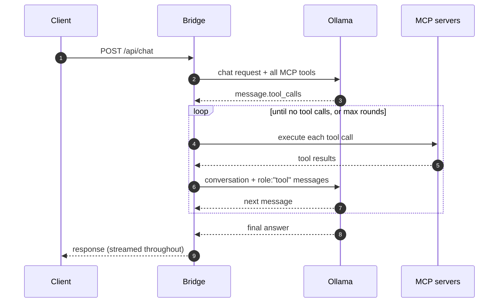

# How it works

## Startup

1. **Load servers.** Every server under `mcpServers` is connected, with the transport
   inferred from its config.
2. **Collect tools.** Tools from all servers are gathered into one flat list, namespaced
   `<server>.<tool>`.
3. **Check for updates.** The bridge asks PyPI whether a newer version exists and logs
   the result.
4. **Check Ollama.** Health is verified before the port is bound, so a misconfigured
   Ollama URL fails immediately rather than at first request.

A server that fails to connect is logged and skipped. The bridge still starts with
whatever else came up.

## Handling a chat request

`/api/chat` is the only endpoint that does anything beyond proxying.

Step by step:

1. The request is forwarded to Ollama with the full tool list injected.
2. If the reply carries `message.tool_calls`, the bridge executes each one against the
   owning MCP server.
3. Results are appended to the conversation as `{"role": "tool", ...}` messages.
4. The loop repeats from step 1.
5. When the model stops asking for tools, the final answer goes back to the client.

Throughout, responses stream to the client in real time — including intermediate
*thinking* messages when the model emits them.

### When the round limit is hit

If [`--max-tool-rounds`](../configuration/cli.md#-max-tool-rounds) is set and reached,
the bridge makes one last call to Ollama with `tools` set to `None`. With no tools
offered, the model has to answer rather than request another call. You always get a
response, never a truncated loop.

### Tool errors don't break the request

When a tool call fails, the bridge catches the error and returns it **as the tool
result**. The model sees the failure as ordinary tool output and can apologise, retry, or
route around it. A broken tool degrades the answer; it doesn't fail the request.

## Everything else

All other endpoints are proxied to Ollama unmodified. Existing clients, SDKs and scripts
work exactly as they did — see [API reference](api.md) for the exceptions.
